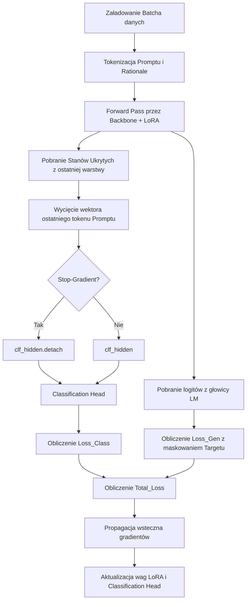

# Jak działa trening AutoQA PEFT Dual-Head?

Niniejszy dokument szczegółowo wyjaśnia architekturę oraz matematyczne i techniczne aspekty procesu uczenia wielozadaniowego (Multi-Task Learning) w naszym systemie AutoQA.

---

## 1. Architektura Dual-Head

Tradycyjne modele językowe cierpią na tzw. *format hallucination* – generując tekst, mogą podać błędną etykietę klasyfikacyjną (np. zaliczyć rozmowę, która nie spełnia kryteriów). 

Nasz system rozwiązuje to poprzez zastosowanie dwóch głowic wyjściowych podpiętych pod wspólny trzon (backbone) modelu `ibm-granite/granite-3.0-3b-a800m-instruct`:

1.  **Causal LM Head (Generacyjna)**: Oryginalna głowica językowamodelu, odpowiedzialna za generowanie tekstu uzasadnienia (rationale).
2.  **Classification Head (Klasyfikacyjna)**: Dedykowany moduł liniowy mapujący reprezentację ukrytą z transformera na logity klas `0` (Failed QA) oraz `1` (Passed QA).

---

## 2. Przepływ Treningu Krok po Kroku

Proces treningu w skrypcie [train.py](file:///home/jan/Informatyka/ML/NLP/llm_classification/train.py) i module [src/training.py](file:///home/jan/Informatyka/ML/NLP/llm_classification/src/training.py) przebiega według poniższego schematu:



### Krok 1: Przygotowanie i Maskowanie Danych (Target Masking)
W klasie [DualHeadCollate](file:///home/jan/Informatyka/ML/NLP/llm_classification/src/data.py):
*   Łączymy tokeny promptu i docelowego uzasadnienia (rationale) w jedną pełną sekwencję `input_ids`.
*   Tworzymy tensor `labels` będący kopią `input_ids`, ale pozycje odpowiadające promptowi zastępujemy wartością `-100`. Ponieważ w PyTorch domyślna wartość `ignore_index` dla funkcji straty `CrossEntropyLoss` wynosi `-100`, model uczy się generowania wyłącznie tekstu uzasadnienia, całkowicie ignorując prompt wejściowy.
*   Zapisujemy indeks ostatniego tokenu promptu (`clf_indices`), na którym ma się odbyć klasyfikacja.

### Krok 2: Forward Pass i Wyciągnięcie Stanów Ukrytych
Przekazujemy dane przez model z parametrem `output_hidden_states=True`. Pobieramy stany z ostatniej warstwy transformera (`outputs.hidden_states[-1]`), co zwraca tensor o kształcie:
$$\text{Shape: } [BatchSize, SeqLen, HiddenSize]$$

### Krok 3: Trasowanie Stanów Ukrytych (Hidden State Routing)
Wyciągamy reprezentację wektorową odpowiadającą **ostatniemu tokenowi promptu** (tuż przed rozpoczęciem generowania uzasadnienia) dla każdego elementu w batchu:
```python
clf_hidden = last_hidden_states[batch_indices, clf_indices]
```
Ten wektor o rozmiarze `[BatchSize, HiddenSize]` stanowi skompresowaną reprezentację całej transkrypcji przed rozpoczęciem dekodowania tekstu.

### Krok 4: Stop-Gradient i Klasyfikacja
Wektor `clf_hidden` trafia do [ClassificationHead](file:///home/jan/Informatyka/ML/NLP/llm_classification/src/models.py). Jeśli w [config.yaml](file:///home/jan/Informatyka/ML/NLP/llm_classification/config.yaml) parametr `stop_gradient_for_classification` wynosi `true`:
*   Wywołujemy `clf_hidden = clf_hidden.detach()`.
*   Gradienty z klasyfikacji **nie propagują się wstecznie** do trzonu modelu (współdzielonych wag LoRA). Chroni to model przed tzw. *task interference* (konfliktem zadań), pozwalając trzonowi optymalizować się wyłącznie pod kątem językowym, podczas gdy głowica klasyfikacyjna dostraja się na zamrożonych reprezentacjach.

### Krok 5: Dopasowanie Logitów Causal LM (Causal Alignment)
Do uczenia generacji stosujemy standardowe przesunięcie autoregresyjne: logit na pozycji $t$ przewiduje token na pozycji $t+1$:
```python
shift_logits = lm_logits[..., :-1, :].contiguous()
shift_labels = lm_labels[..., 1:].contiguous()
```

### Krok 6: Kalkulacja Straty i Aktualizacja Parametrów
Obliczamy stratę całkowitą jako sumę ważoną obu zadań:
$$\text{Total Loss} = (\alpha \times \text{Loss}_{\text{Class}}) + (\beta \times \text{Loss}_{\text{Gen}})$$

Wsteczna propagacja gradientów (`total_loss.backward()`) oraz krok optymalizatora (`optimizer.step()`) aktualizują:
1.  **Wagi adapterów LoRA** w trzonie transformera (sterowane przez $\text{Loss}_{\text{Gen}}$ oraz opcjonalnie $\text{Loss}_{\text{Class}}$, jeśli stop-gradient jest wyłączony).
2.  **Wagi głowicy klasyfikacyjnej** (sterowane wyłącznie przez $\text{Loss}_{\text{Class}}$).
